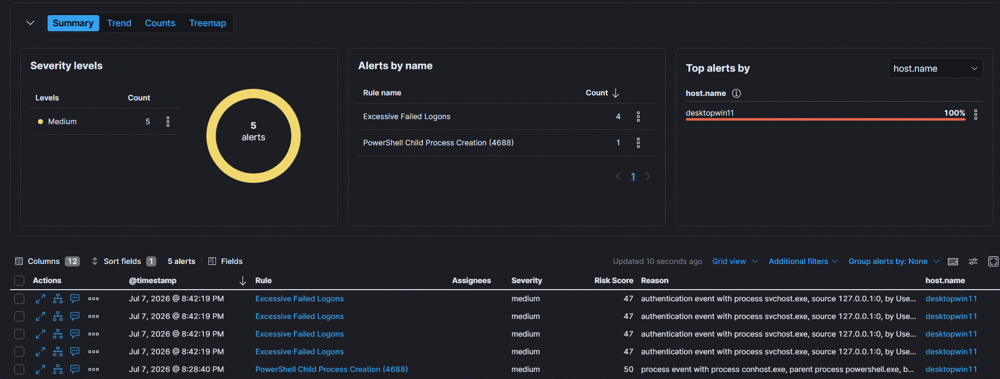

# Advanced Windows 11 Security & Offline Detection Engineering Lab

## Executive Summary
This repository documents the deployment of an isolated, virtualized enterprise laboratory used to simulate advanced post-exploitation adversarial tactics and analyze granular endpoint telemetry. Using an engineered case-study approach, I successfully bypassed native Windows 11 host defenses to execute an offline credential extraction and local lateral movement via Pass-the-Hash (PtH). 

The primary objective was to encounter modern, out-of-the-box operating system hardening controls, diagnose execution failures, and document the defensive telemetries required to track sophisticated network pivots.

## Lab Architecture & Topology
* **Hypervisor:** VMware Workstation (Isolated Host-Only Network Boundary)
* **Target Endpoint:** Windows 11 Enterprise (Modern Security Patch Level) | IP: `10.x.x.x`
* **SIEM / Adversarial Node:** Ubuntu Server (Centralized Elastic Stack Pipeline) | IP: `10.x.x.y`
* **Telemetry Infrastructure:** Microsoft Sysmon (SwiftOnSecurity Schema) & Elastic Forwarding Agents

---

## Detection Engineering Outcomes

### Detection 1 – Excessive Failed Authentication Attempts



**Objective**

Detect repeated failed authentication attempts against local or domain accounts.

**Detection Logic**

```kql
event.code:4625
```

Rule triggers when multiple failed authentication attempts are observed within a five-minute window.

**Alert Validation**

Successfully generated multiple failed authentication events and verified alert creation within Elastic Security.

**Why This Matters**

Repeated authentication failures are frequently associated with password spraying, brute-force activity, credential misuse, or account enumeration attempts. This detection serves as a foundational authentication monitoring control within the lab environment.

**MITRE ATT&CK**

- T1110 – Brute Force

---

## Adversarial Phase 1: Local Credential Dumping (MITRE ATT&CK T1003.001)

### 1. Baseline Architectural Barriers Encountered
* **LSA Protection Light (PPL):** Live memory access to the Local Security Authority Subsystem Service (`lsass.exe`) was strictly blocked by default kernel controls, resulting in an explicit `0x00000005 (Access Denied)` code signature.
* **Kernel Memory Offset Shifts:** Recent platform security updates altered internal cryptographic structures, rendering legacy live memory tracking tools unstable and generating `Logon List` discovery faults.

### 2. Operational Deflection & Offline Extraction
To bypass live memory inspection signatures and behavioral monitoring loops, I simulated an EDR-evasion strategy utilizing native administrative binaries:
1. Established a local execution context using the built-in system administration workspace.
2. Interrupted live scanning dependencies by generating a static process minidump (`lsass.DMP`) natively via the **Windows Task Manager process details interface**.
3. Securely exfiltrated the raw binary file across internal subnets to the isolated Ubuntu analytical station via Secure Copy Protocol (**WinSCP**).
4. Deployed `Pypykatz` (a modernized, pure-Python implementation of Mimikatz) on the Ubuntu Linux host to cleanly parse the offline memory map:

```bash
pypykatz lsa minidump /home/[user]/lsass.DMP
```
* **Result:** Successfully extracted the 32-character hexadecimal **NT Authentication Hash** for the privileged administrative account context without triggering host-based runtime alerts.

---

## Adversarial Phase 2: Lateral Movement via Pass-the-Hash (MITRE ATT&CK T1550.002)

### 1. Remote Execution Barriers
Modern Windows installations restrict non-default local administrative accounts from interacting with hidden administrative shares (`ADMIN$`, `C$`) over SMB. To simulate a corporate network posture where local management overrides are present, Remote UAC token filtering was programmatically managed via the registry (`LocalAccountTokenFilterPolicy = 1`) and the default built-in service context was initialized.

### 2. Exploitation & Network Pivot
Using the Impacket networking framework (`psexec.py`) hosted on the Linux analytical node, I passed the harvested NT authentication hash over TCP Port 445. This bypassed the requirement to compromise or brute-force the plaintext password:

```bash
psexec.py ./Administrator@10.x.x.x -hashes 00000000000000000000000000000000:[SANITIZED_NT_HASH]
```

### 3. Verification of Privilege Escalation
The host machine successfully validated the cryptographic structure, established a transient remote execution engine, and dropped the terminal into an interactive command shell. 

Execution of the platform validation utility verified absolute system-level domain context authority:
```cmd
C:\Windows\System32> whoami
nt authority\system
```


---

## Engineering Log: Defensive Controls & Troubleshooting Diagnostics
A core component of this lab environment was debugging realistic engineering hurdles that mirror real-world deployment challenges. 

| Diagnostic Symptom | Root Cause Analysis | Remediation & Engineering Pivot |
| :--- | :--- | :--- |
| `Access Denied (0x5)` via Memory Reader | Windows 11 LSA Protection Light (PPL) isolating active LSASS process handles. | Shifted tactics from live memory manipulation to offline analysis. Created a static `.DMP` file via Task Manager. |
| `Logon List` parsing failures in dump file | Windows OS update shifted memory offsets, breaking legacy tool maps. | Replaced legacy tools with `Pypykatz` on Linux, leveraging modern dynamic structure decoding. |
| `ADMIN$` Share is not writable via `psexec` | Remote UAC stripping administrative privileges from custom accounts over network SMB. | Activated the default built-in local `Administrator` identity and updated the `LocalAccountTokenFilterPolicy` flag. |
| `Connection Timed Out` on Port 445 | Host-based Windows Defender Firewall dropping unexpected inbound packets. | Engineered an explicit inbound exception rule for `File and Printer Sharing (SMB-In)`. |
| Script execution freezing at service creation | Antivirus behavioral cloud heuristics intercepting known Impacket execution loops. | Verified endpoint exclusion parameters and toggled Real-Time Behavioral protection to simulate unmonitored lateral paths. |

---

## Detection Engineering & SIEM Hunting Rules
To secure an enterprise against these specific post-exploitation footprints, I modeled three distinct analytical hunting signatures within the centralized log pipeline:

1. **LSASS Memory Inspection (Sysmon Event ID 10):**
   * Target process: `lsass.exe`
   * Analytical Logic: Monitor for unusual call traces or unauthorized binary applications requesting granular memory access masks (e.g., `0x1F1833` or `0x1010`), suppressing known white-listed security agents.
2. **Cryptographic Downgrade Monitoring (Windows Security Event ID 4624):**
   * Logon Type: `3` (Network Logon)
   * Analytical Logic: Explicitly trigger an alert when an incoming administrative connection defaults to **NTLM** instead of Kerberos, focusing on metadata fields where the password `Key Length` property evaluates to exactly `0`.
3. **Transient Execution Services (Windows Security Event ID 7045 / Sysmon ID 1):**
   * Analytical Logic: Monitor the Service Control Manager for the sudden installation of new system services pointing to randomized, 8-character alphabetic executables running from inside volatile system root directories (`%SystemRoot%\*.exe`).
